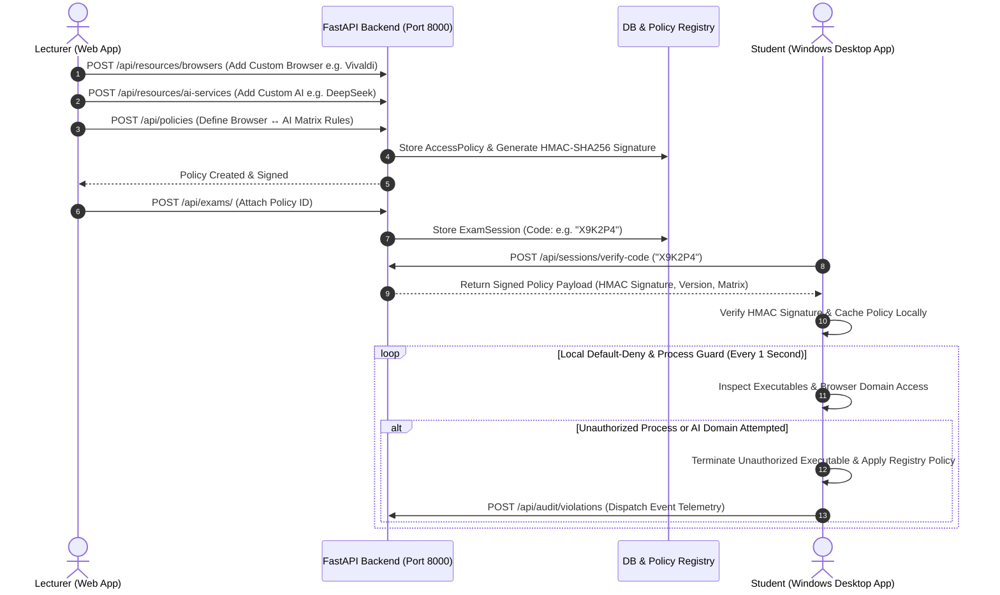

# Kasim System Architecture & Policy Engine Operations Manual

## 1. Overview & Repository Architecture

Kasim is a policy-based access-control platform for student desktop environments controlled remotely by a lecturer through a web dashboard.

The system uses a **Central Policy Engine** implementing a strict **Default-Deny Principle**:
- Lecturers explicitly define authorized browsers, AI services, and Browser ↔ AI matrix combinations.
- Anything not explicitly authorized is automatically denied on student devices.

```
kasim/
├── backend/                      # FastAPI Python Application (PostgreSQL 18)
│   ├── app/
│   │   ├── main.py               # FastAPI entry point, CORS & router inclusion
│   │   ├── database.py           # PostgreSQL 18 SQLAlchemy connection pool
│   │   ├── models.py             # DB models (User, ExamSession, AccessPolicy, Resource, AuditViolation)
│   │   ├── schemas.py            # Pydantic validation schemas
│   │   ├── security.py           # JWT tokens & bcrypt password hashing
│   │   ├── policy_engine.py      # Core Default-Deny Matrix Engine & HMAC Signer
│   │   └── routers/
│   │       ├── auth.py           # User registration, login, JWT token auth
│   │       ├── resources.py      # Dynamic Browser & AI Resource Registration CRUD
│   │       ├── policies.py       # Policy creation, matrix validation, signatures
│   │       ├── exams.py          # Exam session creation & policy linking
│   │       ├── sessions.py       # Code verification, signed policy distribution, heartbeats
│   │       └── audit.py          # Real-time violation logs & monitoring
│   └── test_policy_engine.py    # Unit tests for Policy Engine matrix evaluation
│
├── lecturer/                     # Flutter Web Application for Lecturers
│   ├── lib/
│   │   ├── models/               # Resource, Policy, Audit & Exam models
│   │   ├── widgets/              # MatrixBuilderWidget, PolicyPreviewDialog
│   │   ├── screens/              # Dashboard, ResourceManager, LiveAuditMonitor, Login
│   │   └── services/             # ApiService (REST HTTP Client)
│
├── student/                      # Flutter Windows Desktop Client & Native Guard
│   ├── lib/
│   │   ├── models/               # StudentSession, LockdownRules models
│   │   ├── services/             # LocalPolicyEngine, PolicyVerifier, BrowserPolicyGuard, LockdownService
│   │   └── screens/              # Entry, Lobby, Active Policy Lockdown UI
│   └── agent_service/            # Python Background Security Guard & Watchdog Supervisor
│       ├── main.py               # Supervisor enforcement loop & violation reporter
│       ├── process_monitor.py    # Process scanner & taskkill supervisor
│       └── policy_cache.py       # Offline cryptographic policy storage verifier
│
└── docs/
    └── ARCHITECTURE.md           # Architecture documentation
```

---

## 2. Policy Engine Architecture & Data Flow



---

## 3. Database Schema

### `browser_resources` Table
- `id` (VARCHAR, PK): Unique browser resource identifier.
- `name` (VARCHAR, UNIQUE): Display name (e.g. `Google Chrome`, `Vivaldi`).
- `executables` (JSON): Executable binary names (e.g. `["chrome.exe", "google-chrome"]`).
- `description` (TEXT): Description text.
- `is_custom` (BOOLEAN): Flag indicating custom lecturer addition vs system default.

### `ai_resources` Table
- `id` (VARCHAR, PK): Unique AI service resource identifier.
- `name` (VARCHAR, UNIQUE): Display name (e.g. `Claude`, `ChatGPT`, `DeepSeek`).
- `domains` (JSON): Hostnames (e.g. `["claude.ai", "api.anthropic.com"]`).
- `desktop_executables` (JSON): Native app binary names (e.g. `["Claude.exe"]`).

### `access_policies` Table
- `id` (VARCHAR, PK): Access policy identifier.
- `title` (VARCHAR): Policy title.
- `version` (INTEGER): Auto-incrementing version number.
- `default_action` (VARCHAR): Default rule fallback (`DENY`).
- `allowed_browsers` (JSON): List of authorized browser resource IDs.
- `allowed_ai` (JSON): List of authorized AI service resource IDs.
- `browser_ai_matrix` (JSON): Map of browser ID -> allowed AI service IDs.
- `allowed_desktop_apps` (JSON): List of authorized desktop AI app binaries.
- `signature` (VARCHAR): HMAC-SHA256 signature for tamper verification.

### `audit_violations` Table
- `id` (VARCHAR, PK): Violation record ID.
- `exam_session_id` (VARCHAR, FK): Associated exam session.
- `student_session_id` (VARCHAR, FK): Participating student session.
- `student_name` (VARCHAR): Student display name.
- `violation_type` (VARCHAR): Event classification (`UNAUTHORIZED_BROWSER`, `UNAUTHORIZED_AI_DOMAIN`).
- `resource_name` (VARCHAR): Offending resource identifier.
- `action_taken` (VARCHAR): Action executed (`BLOCKED`, `TERMINATED`).
- `timestamp` (TIMESTAMP): UTC event timestamp.

---

## 4. Default-Deny Rule Evaluation Matrix

| Browser | Target Resource / AI Domain | Matrix Status | Result |
|---|---|---|---|
| Chrome | Standard Website (`wikipedia.org`) | N/A | **ALLOW** |
| Chrome | Authorized AI (`claude.ai`) | Explicitly Allowed in Matrix | **ALLOW** |
| Chrome | Unauthorized AI (`chatgpt.com`) | Not in Chrome Matrix | **DENY** |
| Firefox | Authorized AI (`claude.ai`) | Firefox Not Authorized | **DENY** |
| Opera | Any Resource | Unregistered Browser | **DENY** |
| Claude Desktop (`Claude.exe`) | Native App | Not in Allowed Apps List | **DENY** |

---

## 5. Local Setup & Execution Guide

### Step 1: Run Backend Service (FastAPI)
```bash
cd backend
python -m venv venv
# On Windows PowerShell: .\venv\Scripts\Activate.ps1
pip install -r requirements.txt
uvicorn app.main:app --reload --port 8000
```
- Interactive API Documentation: `http://localhost:8000/docs`

### Step 2: Run Lecturer Web Dashboard
```bash
cd lecturer
flutter pub get
flutter run -d chrome --web-port 3000
```

### Step 3: Run Student Windows Desktop Client
```bash
cd student
flutter pub get
flutter run -d windows
```
