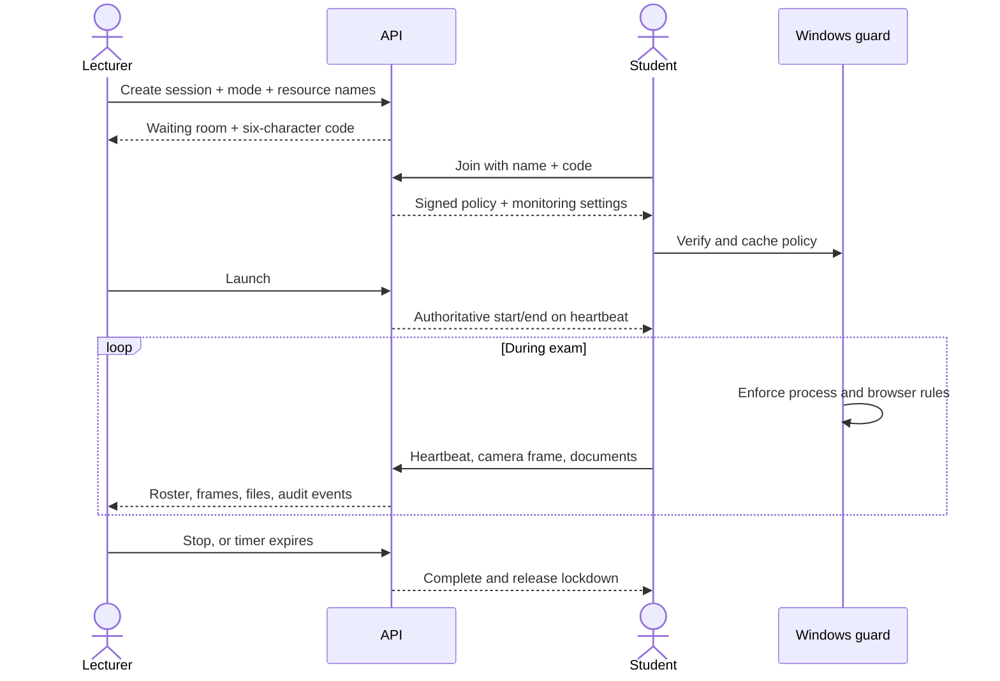

# Kasim 3.0 architecture

## Product surfaces

```
lecturer/  Flutter web control plane
student/   Flutter Windows client + local policy guard
backend/   FastAPI, SQLAlchemy, signed policy engine, file/camera services
docs/      Architecture and deployment guidance
```

The lecturer creates a waiting room. The API registers only the browser/AI
identities entered for that session, builds a signed default-deny policy, and
returns a six-character code. Students enter their name and code in the Windows
client. The lecturer launches the session; the API stamps one authoritative
start/end time and every client counts down from heartbeat data.

## Policy modes

| Product mode | `browser_mode` | `ai_mode` | `web_access_scope` |
| --- | --- | --- | --- |
| `SPECIFIC_BROWSER` | `ALLOW_SELECTED` | `ALLOW_ANY` | `ANY_SITE` |
| `SPECIFIC_AI` | `ALLOW_ANY` | `ALLOW_SELECTED` | `AI_ONLY` |
| `SPECIFIC_BROWSER_NO_AI` | `ALLOW_SELECTED` | `BLOCK_ALL` | `ANY_SITE` |
| `ANY_BROWSER_NO_AI` | `ALLOW_ANY` | `BLOCK_ALL` | `ANY_SITE` |
| `SPECIFIC_BROWSER_AND_AI` | `ALLOW_SELECTED` | `ALLOW_SELECTED` | `ANY_SITE` |

There is no seed catalogue. A named browser is recorded with lecturer-supplied
executable aliases; a named AI is recorded with lecturer-supplied domains and
optional desktop executable aliases. The accumulated dynamic registry helps the
client identify alternatives while the active policy remains default-deny.

## Session sequence



## Camera design

Camera monitoring is opt-in per session. A required session initializes the
student's front camera and uploads a low-resolution JPEG approximately every six
seconds. The API keeps only the latest frame path on the student session; the
lecturer grid refreshes alongside the monitor. Status values are `pending`,
`active`, `denied`, `unavailable`, and `not_required`.

This is intentionally snapshot-based rather than a peer-to-peer video system,
which keeps the prototype simple and bandwidth predictable. A production
deployment needs consent, retention/deletion policy, encryption, access logs,
regional privacy review, and object-storage lifecycle rules.

## Submission design

Students upload common office, image, archive, and source-code formats. The API
sanitizes names, enforces a configurable size/extension policy, stores a SHA-256
digest, and keeps the original filename separately from its random storage name.
The lecturer can download individual files or one ZIP arranged by student. The
archive filename is `<session-title>-<YYYY-MM-DD>.zip`.

## Authentication

Email/password accounts use bcrypt. Google sign-in accepts a Google Identity
Services ID token and verifies its audience and verified-email claim on the API;
the browser never supplies a trusted email directly. A Google lecturer can add a
dedicated password through profile settings.

## Enforcement layers

1. Signed policy verification and offline expiry checks.
2. Windows running-process inspection using policy-provided executable aliases.
3. Unauthorized known-browser termination for selected-browser modes.
4. Chromium-family managed URL block/allow policies for entered browsers.
5. Heartbeat compliance and audit telemetry.

No desktop program can offer high-assurance lockdown without operating-system
privileges and managed network/browser controls. For formal exams, code-sign the
client, install the guard as an organization-managed service, restrict local admin
rights, and validate each supported browser adapter in the institution's image.

## Data model additions

- `ExamSession`: policy mode, AI display name, camera flag, submission flag,
  description, and authoritative timing.
- `AccessPolicy`: product mode and web access scope in addition to the browser/AI
  matrix.
- `StudentSession`: camera state/latest frame and completion time.
- `Submission`: ownership, original/stored names, type, byte size, SHA-256, and
  upload time.

The included `schema_compat.py` adds the new columns to existing SQLite developer
databases. Production PostgreSQL should use managed migrations.
